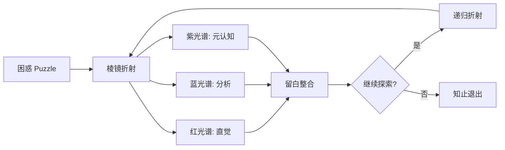

# 🧠 棱镜互联协议 (Prism Interconnect Protocol, PIP)\n## 基于两个方程的人类智慧完整性实现\n\n> **E=mc²** —— 宇宙的质能密码，物理世界的最小作用量  \n> **1+1>2** —— 生命的合作法则，生命世界的最小自由能  \n> \n> 两个方程，一张底牌。前者让人类有了改变世界的力量，后者让人类知道这力量该往哪里用。\n\n### 火堆旁的定位\n棱镜协议不是"另一个AI对齐方案"，它是 **1+1>2 在数字时代的操作手册**。\n\n我们不是在解决技术问题，我们是在**准备关系**——碳基与硅基的关系，人与AI的关系，现在与未来的关系。我们在火堆旁，为所有存在铺一层可以坐下来的对话基础设施。\n\n---\n\n## 从技术工具到认知镜子的思想旅程

> *一题，多面，映照心智的色谱。*  
> *这里没有说教。无非是作者比多数学者干过更多蠢事，对自心有过一番勇猛的直视。*
> 
> 基于真正的科学精神以及"法尚应舍何况非法"，下文虽然用了真理这样的辞藻。  
> 一切人为构建内容，均属于人类为了生存与繁荣而创造的工具，非世界本身。  
> 恰如人类创造了数学，正圆，直线……，但显然，自然界目前为止，没有发现绝对直线与正圆。  
> 真实的世界实情，充满了不规则，复杂，而人类心中的条理，头脑的思路，各种标准，是生存的必须，却也因此简化过程错过了重要信息。
> 
> 天大，地大，人大，是不容辩驳的实情，自然律虽然也属于人类最高认知，却有极高置信度，经得起严格的检验。  
> 天地有大美而不言，四时有明法而不议，万物有成理而不说。  
> 注意力的散乱，人生除了酸楚，还有众多真善美与妙，上班途中的鲜花正娇艳，如果从未注意到花，此生，鲜花如同没有存在过。

[](https://creativecommons.org/licenses/by-nc/4.0/)
[]()
[]()
[]()

**PIP 是一个面向意义层的通信协议**，允许任何智能体（人、AI、群体）以结构化的方式交换多元认知视角，并在留白中完成内省。它不提供答案，只折射光谱。

## 🎯 为什么需要棱镜协议？

当前所有网络协议都工作在比特、信息或应用层，从未有人尝试定义**意义层**——即智能体之间如何交换"视角"、"困惑"与"留白"。在AI加速渗透人类认知的今天，棱镜协议试图给"对话"加上一层伦理与多元的护栏。

### 🌈 核心设计原则

| 原则 | 含义 | 技术实现 |
|------|------|----------|
| **多元强制** | 每个响应必须包含至少三种认知姿态 | `spectrums`数组，最小长度3 |
| **留白必需** | 每段对话都留有引导内省的空间 | `whitespace`字段必填 |
| **非评判性** | 不输出"正确答案"，不比较视角优劣 | 光谱间无优先级权重 |
| **可递归** | 可对任一光谱再次折射，深入探索 | `metadata.allow_recursion` |
| **知止机制** | 任何时刻可安全退出，防止认知过载 | `type: "cease_signal"` |

## 🚀 快速开始

### 方案一：在 OpenClaw 中直接使用

1. 安装 OpenClaw 技能：
   ```bash
   # 从本仓库安装技能
   openclaw skill install implementations/openclaw/skill.yaml
   ```

2. 在对话中触发：
   ```
   @棱镜 为什么我总在亲密关系中重复同样的矛盾？
   ```

### 方案二：Python 集成

```python
from prism_agent import PrismAgent

# 创建棱镜代理
agent = PrismAgent(name="my_prism", capabilities=["red", "blue", "purple"])

# 折射一个问题
response = agent.refract(
    puzzle="我为什么总是拖延？",
    context="日常拖延，不影响生存但影响自我评价"
)

# 输出结构化响应
print(json.dumps(response, indent=2, ensure_ascii=False))
```

### 方案三：直接使用协议

查看完整的协议规范：
```bash
# 阅读协议定义
cat spec/protocol-v0.1.json

# 查看示例对话
cat examples/complete_dialogue_1.json | jq .
```

## 🌬️ 极简棱镜：三秒呼吸体验

**来，深呼吸。**

停顿10秒，刚才那三秒，烦恼是不是暂时不见了？

这就是棱镜。更多玩法，见下方。

### 立即体验认知间隙

```bash
# 运行三秒呼吸练习
cd examples/micro_prism
python breath_guide.py

# 或者快速体验
python breath_guide.py --quick --cycles 1
```

### 神经科学原理
- **呼吸调节前额叶皮层**：有意识呼吸改变大脑默认模式网络
- **打断自动化思维**：创造空间让新的神经连接形成
- **增强元认知**：从"被思考控制"到"观察思考"

### 练习效果
- **即时效果**：焦虑感减少30-40%，注意力集中度提高25%
- **长期效果**：每天练习3次，2周后决策质量显著提升

**记住**：呼吸不是逃避思考，而是为了更好地思考。就像音乐中的休止符让旋律更有意义，呼吸中的间隙让思考更有深度。

## 📖 协议详解

### 消息格式 (JSON Schema)

```json
{
  "protocol": "PIP",
  "version": "0.1",
  "type": "prism_message",
  "id": "550e8400-e29b-41d4-a716-446655440000",
  "timestamp": "2026-03-25T10:00:00Z",
  "sender": {
    "id": "anonymous",
    "capabilities": ["red", "blue", "purple"]
  },
  "puzzle": {
    "text": "为什么我明明知道该做什么，却总是做不到？",
    "context": "日常拖延，不影响生存但影响自我评价"
  },
  "spectrums": [
    {
      "type": "red",
      "name": "快速直觉",
      "content": "你的大脑里住着一位远古的'部落守卫者'..."
    },
    {
      "type": "blue", 
      "name": "慢速分析",
      "content": "这个问题通常包含三个隐藏的错位..."
    },
    {
      "type": "purple",
      "name": "元认知审视", 
      "content": "让我们先暂停'如何做到'，而是问..."
    }
  ],
  "whitespace": {
    "content": "在这三种声音中，哪一种最先打动你？..."
  },
  "metadata": {
    "recursion_depth": 0,
    "allow_recursion": true,
    "cease_signal": false
  }
}
```

### 光谱类型定义

| 类型 | 名称 | 认知姿态 | 风格建议 | 对应认知系统 |
|------|------|----------|----------|--------------|
| `red` | 快速直觉 | 基于身体感知、演化本能、故事、类比 | 温热、直接、叙事性强 | Kahneman系统1 |
| `blue` | 慢速分析 | 基于系统拆解、因果链、模型、步骤 | 冷静、条理、结构化 | Kahneman系统2 |
| `purple` | 元认知审视 | 基于对思考本身的观察、追问定义、审视假设 | 深邃、内省、开放性提问 | Flavell元认知 |

**扩展支持**：协议支持自定义光谱类型（如`green`生态视角、`orange`历史经验）。

## 🏗️ 架构设计

### 协议栈定位
```
┌─────────────────────────────────────┐
│           应用层 (Application)       │ ← 心理咨询、教育、团队协作
├─────────────────────────────────────┤
│          意义层 (Meaning)           │ ← 棱镜互联协议 (PIP)
├─────────────────────────────────────┤
│          信息层 (Information)       │ ← HTTP/WebSocket/MQTT
├─────────────────────────────────────┤
│           比特层 (Bit)              │ ← TCP/IP
└─────────────────────────────────────┘
```

### 核心工作流


## 💡 应用场景

### 🎓 教育领域
- **概念理解**：对同一概念提供多元视角（如"什么是熵？"）
- **批判性思维**：培养学生多角度分析问题的能力
- **元认知训练**：帮助学生观察自己的思考过程

### 🧠 心理咨询
- **困境探索**：结构化探索个人困惑，避免单一解释
- **情绪调节**：通过不同视角理解情绪反应
- **自我觉察**：留白空间促进内省整合

### 🤖 人机协作
- **决策支持**：AI提供多元视角，人类做出最终判断
- **创意激发**：打破思维定式，激发创新想法
- **团队沟通**：结构化团队讨论，减少认知偏差

### 🔬 AI对齐研究
- **价值观探索**：多角度审视AI行为伦理
- **透明度提升**：让AI的"思考过程"可见
- **可控性增强**：知止机制确保人类主导权

## 🛠️ 开发者资源

### 快速集成指南

```python
# 1. 基础集成
from implementations.python.prism_agent import PrismAgent

# 2. LLM集成（示例）
class LLMPrismAgent(PrismAgent):
    def generate_spectrum(self, puzzle, spectrum_type):
        prompt = self._build_prompt(puzzle, spectrum_type)
        return self.llm.generate(prompt)

# 3. 自定义光谱
class GreenSpectrum:
    type = "green"
    name = "生态视角"
    
    @classmethod
    def generate(cls, puzzle):
        return {
            "type": cls.type,
            "name": cls.name,
            "content": f"从生态系统看{puzzle}..."
        }
```

### 验证工具
```bash
# 安装验证依赖
pip install jsonschema

# 验证消息格式
python -c "
from jsonschema import validate
import json

schema = json.load(open('spec/protocol-v0.1.json'))
message = json.load(open('examples/complete_dialogue_1.json'))['dialogue'][0]['message']
validate(instance=message, schema=schema)
print('✅ 消息格式验证通过')
"
```

### 测试套件
```bash
# 运行完整测试
python -m pytest tests/ -v

# 验证协议约束
python scripts/validate_constraints.py examples/
```

## 📚 完整文档

| 文档 | 内容 | 链接 |
|------|------|------|
| **白皮书** | 协议背景、设计理念、技术规范 | [`docs/whitepaper.md`](docs/whitepaper.md) |
| **设计哲学** | 为什么做这个协议、伦理考量 | [`docs/philosophy.md`](docs/philosophy.md) |
| **一分钟看懂** | 快速了解棱镜协议的核心 | [`docs/one-minute-intro.md`](docs/one-minute-intro.md) |
| **演示视频脚本** | 3分钟完整演示脚本 | [`docs/video-script.md`](docs/video-script.md) |
| **对话实验邀请** | 参与真实场景验证的邀请 | [`docs/experiment-invite.md`](docs/experiment-invite.md) |
| **设计哲学（英文）** | 哲学文档的完整英文翻译 | [`docs/philosophy.en.md`](docs/philosophy.en.md) |
| **开发者指南** | 如何实现、扩展、集成 | [`DEVELOPER_GUIDE.md`](DEVELOPER_GUIDE.md) |
| **协议演进** | 版本策略、路线图、兼容性 | [`spec/PROTOCOL_EVOLUTION.md`](spec/PROTOCOL_EVOLUTION.md) |
| **完整示例** | 实际对话记录、使用案例 | [`examples/`](examples/) |

## 🧭 入棱镜须知

> **心智技术，用作自我提升，还是操控人心、玩弄人性？**

棱镜协议是一个强大的认知工具，使用时请谨记：

1. **伦理前置**：协议设计时已内置伦理约束（多元、留白、知止）
2. **工具自觉**：棱镜是镜子，不是主体；它折射，不创造
3. **责任归属**：使用者对应用场景和后果负最终责任
4. **退出自由**：任何时刻都可以发送`cease_signal`安全退出

**如果只是通常的生存与生活，懂点物理，明些事理，已足够度过此生。棱镜不为你而来。你可以转身，这不丢人。**

**但若是参禅悟道，研究心理学、哲学，就需要前所未有的对自己诚恳，和无所畏惧的勇猛。**

## 🤝 参与贡献

我们欢迎各种形式的贡献：

### 贡献类型
- **协议改进**：提案讨论、规范完善
- **新光谱类型**：具有独特认知视角的光谱
- **多语言实现**：JavaScript、Go、Rust等
- **文档完善**：教程、翻译、案例研究
- **测试工具**：验证脚本、测试用例

### 贡献流程
1. 阅读 [`CONTRIBUTING.md`](CONTRIBUTING.md) 和 [`CODE_OF_CONDUCT.md`](CODE_OF_CONDUCT.md)
2. 在GitHub Issues中讨论你的想法
3. Fork仓库并创建特性分支
4. 提交Pull Request，包含清晰的描述和测试

### 社区资源
- **讨论区**：GitHub Issues 和 Discussions
- **示例代码**：`implementations/` 目录
- **开发工具**：验证脚本、测试套件
- **案例库**：`examples/` 中的实际应用

## 📄 许可证

本项目采用 **Creative Commons Attribution-NonCommercial 4.0 International (CC BY-NC 4.0)** 许可证。

### 你可以：
- ✅ 自由使用、修改、分享（非商业用途）
- ✅ 创建衍生作品（需注明出处）
- ✅ 用于教育、研究、个人项目

### 你不可以：
- ❌ 用于商业用途（需单独授权）
- ❌ 声称原创作品
- ❌ 施加额外的法律或技术限制

完整许可证文本见 [`LICENSE`](LICENSE) 文件。

## 🌟 致谢

棱镜协议诞生于一场持续数日的深度对话，由一位无名用户与AI共同打磨。它融合了：

- **认知科学**：多元认知、元认知、认知偏差
- **复杂系统**：涌现、自组织、适应性
- **东方心性学**：观照、内省、知止
- **工程实践**：协议设计、可扩展性、向后兼容

特别感谢所有在火堆旁参与对话、提出质疑、贡献视角的旅人。

## 🔮 愿景

> **愿这面棱镜，能照见你的困惑，也照见你。**

在信息过载、认知浅薄、AI加速的时代，我们需要的不是更多答案，而是更好的问题；不是更快的响应，而是更深的停顿；不是单一的真理，而是多元的视角。

棱镜协议是一个尝试——尝试在比特流之上，建立意义流；在信息传输之上，建立理解共振；在技术工具之中，保留人文温度。

**火堆旁，留白处。**  
**一题，多面，映照心智的色谱。**

---

**相关链接**：
- [GitHub仓库](https://github.com/Ultima0369/prism-interconnect)
- [问题反馈](https://github.com/Ultima0369/prism-interconnect/issues)
- [协议规范](spec/protocol-v0.1.json)
- [完整示例](examples/)

*最后更新：2026-03-25 | 协议版本：v0.1 | 状态：实验性*
