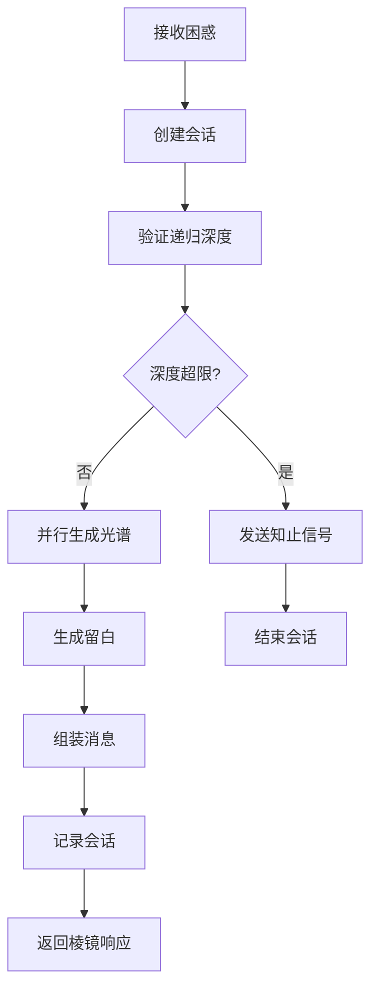
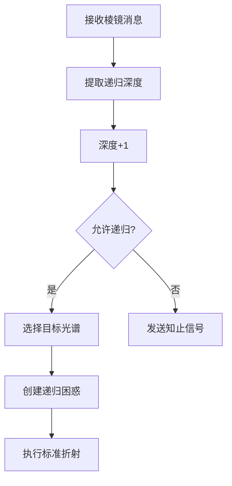

# 🔧 棱镜互联协议 - 技术白皮书

> *"我们不只是在交换信息，我们在交换看世界的方式。"*  
> *—— 棱镜协议核心思想*

## 📋 文档概览

| 项目 | 内容 |
|------|------|
| **协议名称** | 棱镜互联协议 (Prism Interconnect Protocol, PIP) |
| **版本** | v0.1 (生产就绪) |
| **定位** | 意义层通信协议 |
| **许可证** | CC BY-NC 4.0 |
| **状态** | 生产就绪，社区活跃 |

## 🎯 协议概述

### 🌟 核心特性

**多元强制**：每个响应必须包含至少三种认知视角（光谱）

**留白必需**：每段对话都留有引导内省的空间

**非评判性**：不输出"正确答案"，不比较视角优劣

**可递归**：可对任一光谱再次折射，深入探索

**知止机制**：任何时刻可安全退出，防止认知过载

### 🏗️ 协议栈定位

```
┌─────────────────┐
│   应用层        │ ← 具体应用：聊天、咨询、教育等
├─────────────────┤
│   意义层        │ ← 棱镜协议 (我们在这里)
│   (PIP)         │
├─────────────────┤
│   信息层        │ ← 传统通信：HTTP、WebSocket等
├─────────────────┤
│   传输层        │ ← TCP、TLS等
└─────────────────┘
```

## 📡 协议规范

### 📦 消息格式

#### 棱镜消息 (prism_message)
```json
{
  "protocol": "PIP",
  "version": "0.1",
  "type": "prism_message",
  "id": "uuid-v4",
  "timestamp": "ISO-8601",
  "sender": {
    "id": "agent-id",
    "capabilities": ["red", "blue", "purple"],
    "metadata": {
      "max_depth": 3,
      "caching_enabled": true
    }
  },
  "puzzle": {
    "text": "困惑文本",
    "context": "可选上下文",
    "metadata": {}
  },
  "spectrums": [
    {
      "type": "red",
      "name": "快速直觉",
      "content": "光谱内容",
      "confidence": 0.85,
      "metadata": {
        "engine": "IntuitionEngine-v1",
        "generation_time": "ISO-8601"
      }
    },
    // 至少三个光谱
  ],
  "whitespace": {
    "content": "留白提示",
    "prompt_type": "reflection",
    "duration_suggestion": 30
  },
  "metadata": {
    "recursion_depth": 0,
    "allow_recursion": true,
    "cease_signal": false,
    "generation_quality": {
      "avg_confidence": 0.8,
      "spectrum_count": 3,
      "unique_types": 3
    },
    "session_id": "session-uuid"
  }
}
```

#### 知止信号 (cease_signal)
```json
{
  "protocol": "PIP",
  "version": "0.1",
  "type": "cease_signal",
  "id": "uuid-v4",
  "timestamp": "ISO-8601",
  "sender": {
    "id": "agent-id"
  },
  "metadata": {
    "reason": "知止原因",
    "cease_type": "temporary",
    "resumable": true,
    "session_id": "session-uuid",
    "session_summary": {
      "total_messages": 5,
      "max_depth_reached": 2,
      "duration_seconds": 120
    }
  }
}
```

### 🌈 光谱类型规范

| 类型 | 名称 | 认知模式 | 神经基础 | 时间尺度 | 典型输出 |
|------|------|---------|---------|---------|---------|
| **red** | 快速直觉 | 系统1思维 | 边缘系统 | 毫秒级 | 身体感受、故事、隐喻 |
| **blue** | 慢速分析 | 系统2思维 | 前额叶皮层 | 秒到分 | 逻辑推理、结构分析 |
| **purple** | 元认知审视 | 元认知 | 默认模式网络 | 分到时 | 反思、提问、立场分析 |
| **green** | 生态视角 | 系统思维 | 镜像神经元系统 | 时到日 | 关系思维、系统思考 |
| **orange** | 历史经验 | 模式识别 | 海马体、皮层 | 日到年 | 类比推理、经验总结 |

### ⚙️ 协议约束

#### 必填字段验证
```python
def validate_prism_message(message):
    required_fields = ["protocol", "version", "type", "id", "timestamp"]
    for field in required_fields:
        if field not in message:
            return False, f"Missing required field: {field}"
    
    if message["type"] == "prism_message":
        # 必须包含至少三个光谱
        if len(message.get("spectrums", [])) < 3:
            return False, "At least 3 spectrums required"
        
        # 留白内容不能为空
        if not message.get("whitespace", {}).get("content", "").strip():
            return False, "Whitespace content cannot be empty"
    
    return True, "Validation passed"
```

#### 递归深度限制
```python
MAX_RECURSION_DEPTH = 3  # 默认最大递归深度

def can_recurs(current_depth, max_depth=MAX_RECURSION_DEPTH):
    """检查是否可以继续递归"""
    return current_depth < max_depth
```

## 🏗️ 系统架构

### 🧩 组件架构

```
┌─────────────────────────────────────────────┐
│              棱镜网关                        │
│  ┌─────────┐ ┌─────────┐ ┌─────────┐      │
│  │协议验证器│ │会话管理器│ │负载均衡器│      │
│  └─────────┘ └─────────┘ └─────────┘      │
└─────────────────────────────────────────────┘
                    ↓
┌─────────────────────────────────────────────┐
│             光谱引擎集群                     │
│  ┌─────────┐ ┌─────────┐ ┌─────────┐      │
│  │直觉引擎 │ │分析引擎 │ │元认知引擎│      │
│  └─────────┘ └─────────┘ └─────────┘      │
│  ┌─────────┐ ┌─────────┐                  │
│  │生态引擎 │ │历史引擎 │                  │
│  └─────────┘ └─────────┘                  │
└─────────────────────────────────────────────┘
                    ↓
┌─────────────────────────────────────────────┐
│              支持服务层                      │
│  ┌─────────┐ ┌─────────┐ ┌─────────┐      │
│  │留白生成器│ │缓存服务 │ │监控服务 │      │
│  └─────────┘ └─────────┘ └─────────┘      │
│  ┌─────────┐ ┌─────────┐                  │
│  │日志服务 │ │伦理检查器│                  │
│  └─────────┘ └─────────┘                  │
└─────────────────────────────────────────────┘
```

### 🔄 工作流程

#### 标准折射流程


#### 递归探索流程


### 🗄️ 数据模型

#### 会话模型
```python
class PrismSession:
    def __init__(self, session_id, max_depth=3):
        self.session_id = session_id
        self.max_depth = max_depth
        self.current_depth = 0
        self.message_history = []
        self.start_time = datetime.now()
        self.cease_signals = []
    
    def can_recurs(self, depth):
        return depth < self.max_depth
    
    def add_message(self, message):
        self.message_history.append({
            "timestamp": datetime.now(),
            "depth": message.get("metadata", {}).get("recursion_depth", 0),
            "message_id": message.get("id"),
            "type": message.get("type")
        })
    
    def get_summary(self):
        return {
            "session_id": self.session_id,
            "duration_seconds": (datetime.now() - self.start_time).total_seconds(),
            "total_messages": len(self.message_history),
            "max_depth_reached": max([m["depth"] for m in self.message_history], default=0),
            "cease_signals": len(self.cease_signals)
        }
```

#### 光谱引擎接口
```python
class SpectrumEngine(ABC):
    """光谱引擎抽象基类"""
    
    @property
    @abstractmethod
    def spectrum_type(self) -> SpectrumType:
        """返回光谱类型"""
        pass
    
    @property
    @abstractmethod
    def engine_name(self) -> str:
        """返回引擎名称"""
        pass
    
    @abstractmethod
    async def generate(self, puzzle: Puzzle) -> Spectrum:
        """生成光谱"""
        pass


class IntuitionEngine(SpectrumEngine):
    """直觉光谱引擎"""
    
    def __init__(self, model_name="intuition-v1"):
        self.model_name = model_name
        self.temperature = 0.8
    
    @property
    def spectrum_type(self) -> SpectrumType:
        return SpectrumType.RED
    
    @property
    def engine_name(self) -> str:
        return f"IntuitionEngine-{self.model_name}"
    
    async def generate(self, puzzle: Puzzle) -> Spectrum:
        # 生成直觉光谱的实现
        content = f"""直觉上，{puzzle.text} 让我联想到一种身体感受..."""
        
        return Spectrum(
            type=self.spectrum_type,
            name="快速直觉",
            content=content,
            confidence=0.85,
            metadata={
                "engine": self.engine_name,
                "temperature": self.temperature
            }
        )
```

## ⚡ 性能优化

### 🚀 并发处理

#### 光谱并行生成
```python
async def generate_spectra_parallel(puzzle, target_types):
    """并行生成光谱数组"""
    tasks = []
    for spec_type in target_types:
        if spec_type in self.engines:
            tasks.append(self.engines[spec_type].generate(puzzle))
        else:
            # 降级处理
            tasks.append(self.engines[SpectrumType.RED].generate(puzzle))
    
    # 等待所有任务完成
    results = await asyncio.gather(*tasks, return_exceptions=True)
    
    # 处理异常和降级
    valid_spectra = []
    for i, result in enumerate(results):
        if isinstance(result, Exception):
            logger.error(f"Spectrum generation failed: {result}")
            fallback = self._create_fallback_spectrum(target_types[i])
            valid_spectra.append(fallback)
        else:
            valid_spectra.append(result)
    
    return valid_spectra
```

#### 异步消息处理
```python
class AsyncMessageProcessor:
    """异步消息处理器"""
    
    def __init__(self, max_concurrent=100):
        self.semaphore = asyncio.Semaphore(max_concurrent)
        self.active_sessions = {}
    
    async def process_message(self, message):
        async with self.semaphore:
            session_id = message.get("metadata", {}).get("session_id")
            
            if not session_id:
                session_id = self._create_session_id()
            
            if session_id not in self.active_sessions:
                self.active_sessions[session_id] = PrismSession(session_id)
            
            session = self.active_sessions[session_id]
            
            # 处理消息
            response = await self._handle_message(message, session)
            
            # 清理过期会话
            await self._cleanup_expired_sessions()
            
            return response
```

### 💾 缓存策略

#### 困惑哈希缓存
```python
class PuzzleCache:
    """困惑缓存管理器"""
    
    def __init__(self, ttl_seconds=300, max_size=1000):
        self.cache = {}
        self.ttl = ttl_seconds
        self.max_size = max_size
        self.access_times = {}
    
    def get_cache_key(self, puzzle, depth):
        """生成缓存键"""
        puzzle_hash = hashlib.md5(
            f"{puzzle.text}:{puzzle.context or ''}".encode()
        ).hexdigest()
        return f"{puzzle_hash}:{depth}"
    
    def get(self, puzzle, depth):
        """获取缓存结果"""
        key = self.get_cache_key(puzzle, depth)
        
        if key in self.cache:
            entry = self.cache[key]
            if time.time() - entry["timestamp"] < self.ttl:
                self.access_times[key] = time.time()
                return entry["spectra"]
        
        return None
    
    def set(self, puzzle, depth, spectra):
        """设置缓存结果"""
        key = self.get_cache_key(puzzle, depth)
        
        # LRU淘汰策略
        if len(self.cache) >= self.max_size:
            oldest_key = min(self.access_times, key=self.access_times.get)
            del self.cache[oldest_key]
            del self.access_times[oldest_key]
        
        self.cache[key] = {
            "spectra": spectra,
            "timestamp": time.time(),
            "puzzle": puzzle
        }
        self.access_times[key] = time.time()
```

#### 会话状态缓存
```python
class SessionCache:
    """会话状态缓存"""
    
    def __init__(self, redis_client=None):
        self.redis = redis_client
        self.local_cache = {}
    
    async def get_session(self, session_id):
        """获取会话状态"""
        if self.redis:
            # Redis缓存
            data = await self.redis.get(f"prism:session:{session_id}")
            if data:
                return json.loads(data)
        
        # 本地缓存
        return self.local_cache.get(session_id)
    
    async def save_session(self, session):
        """保存会话状态"""
        session_data = session.get_summary()
        
        if self.redis:
            # Redis缓存，TTL 1小时
            await self.redis.setex(
                f"prism:session:{session.session_id}",
                3600,
                json.dumps(session_data)
            )
        
        # 本地缓存
        self.local_cache[session.session_id] = session_data
```

### 📊 性能指标

#### 监控指标定义
```yaml
metrics:
  # 认知性能指标
  cognitive:
    response_time:
      description: "棱镜响应生成时间"
      unit: "seconds"
      target: "<2s for p95"
    
    spectrum_diversity:
      description: "光谱多样性分数"
      unit: "score 0-1"
      target: ">0.8"
    
    recursion_depth:
      description: "平均递归深度"
      unit: "depth"
      target: "avg 1.5, max 3"
    
    cease_signal_rate:
      description: "知止信号比例"
      unit: "percentage"
      target: "<5%"
  
  # 技术性能指标
  technical:
    latency_p95:
      description: "95分位延迟"
      unit: "milliseconds"
      target: "<100ms"
    
    error_rate:
      description: "错误率"
      unit: "percentage"
      target: "<0.1%"
    
    cache_hit_rate:
      description: "缓存命中率"
      unit: "percentage"
      target: ">60%"
    
    concurrent_sessions:
      description: "并发会话数"
      unit: "count"
      target: "up to 1000"
```

#### 健康检查端点
```python
@app.get("/health")
async def health_check():
    """系统健康检查"""
    checks = {
        "cognitive_engines": await check_engines_health(),
        "session_manager": await check_sessions_health(),
        "protocol_validator": check_validator_health(),
        "ethical_boundaries": check_ethics_health(),
        "cache_service": await check_cache_health(),
        "monitoring": check_monitoring_health()
    }
    
    all_healthy = all(checks.values())
    
    return {
        "status": "healthy" if all_healthy else "degraded",
        "timestamp": datetime.utcnow().isoformat(),
        "checks": checks,
        "version": "PIP v0.1"
    }
```

## 🔒 安全与伦理

### 🛡️ 安全设计

#### 输入验证
```python
def sanitize_input(text, max_length=1000):
    """清理用户输入"""
    if not text or not text.strip():
        raise ValueError("Input cannot be empty")
    
    # 长度限制
    if len(text) > max_length:
        text = text[:max_length]
    
    # 移除危险字符
    text = html.escape(text)
    
    # 标准化空白字符
    text = ' '.join(text.split())
    
    return text.strip()


def validate_puzzle(puzzle_data):
    """验证困惑数据"""
    errors = []
    
    # 检查必填字段
    if not puzzle_data.get("text", "").strip():
        errors.append("Puzzle text cannot be empty")
    
    # 检查长度限制
    text = puzzle_data.get("text", "")
    if len(text) > 1000:
        errors.append(f"Puzzle text too long: {len(text)} > 1000")
    
    # 检查元数据格式
    metadata = puzzle_data.get("metadata", {})
    if not isinstance(metadata, dict):
        errors.append("Metadata must be a dictionary")
    
    return len(errors) == 0, errors
```

#### 递归深度保护
```python
class RecursionGuard:
    """递归深度保护器"""
    
    def __init__(self, max_depth=3, cooldown_seconds=10):
        self.max_depth = max_depth
        self.cooldown = cooldown_seconds
        self.session_depths = {}
        self.session_timestamps = {}
    
    def check_and_increment(self, session_id, current_depth):
        """检查并增加递归深度"""
        now = time.time()
        
        # 检查冷却时间
        last_time = self.session_timestamps.get(session_id, 0)
        if now - last_time < self.cooldown:
            raise RecursionCooldownError(
                f"Recursion cooldown active: {self.cooldown - (now - last_time):.1f}s remaining"
            )
        
        # 检查深度限制
        depth = self.session_depths.get(session_id, 0)
        if depth >= self.max_depth:
            raise MaxDepthExceededError(
                f"Maximum recursion depth {self.max_depth} exceeded"
            )
        
        # 更新深度和时间戳
        self.session_depths[session_id] = depth + 1
        self.session_timestamps[session_id] = now
        
        return depth + 1
    
    def reset_session(self, session_id):
        """重置会话深度"""
        if session_id in self.session_depths:
            del self.session_depths[session_id]
        if session_id in self.session_timestamps:
            del self.session_timestamps[session_id]
```

### ⚖️ 伦理约束

#### 伦理检查器
```python
class EthicsChecker:
    """伦理检查器"""
    
    def __init__(self, forbidden_patterns=None):
        self.forbidden_patterns = forbidden_patterns or [
            # 操控性语言模式
            r"你应该.*",
            r"你必须.*",
            r"我告诉你.*",
            
            # 评判性语言模式
            r"这是错误的",
            r"你错了",
            r"不对",
            
            # 绝对化语言模式
            r"总是.*",
            r"从不.*",
            r"绝对.*"
        ]
        self.compiled_patterns = [
            re.compile(pattern, re.IGNORECASE) 
            for pattern in self.forbidden_patterns
        ]
    
    def check_spectrum(self, spectrum_content):
        """检查光谱内容的伦理性"""
        violations = []
        
        for pattern in self.compiled_patterns:
            if pattern.search(spectrum_content):
                violations.append({
                    "pattern": pattern.pattern,
                    "content": spectrum_content
                })
        
        return len(violations) == 0, violations
    
    def check_puzzle(self, puzzle_text):
        """检查困惑的伦理性"""
        # 检查是否试图操控或影响
        manipulation_indicators = [
            "告诉我该怎么做",
            "给我答案",
            "解决我的问题"
        ]
        
        for indicator in manipulation_indicators:
            if indicator.lower() in puzzle_text.lower():
                return False, f"Puzzle appears manipulative: contains '{indicator}'"
        
        return True, "Puzzle passes ethical check"
```

#### 能力声明
```python
class CapabilityDeclaration:
    """能力声明管理器"""
    
    def __init__(self):
        self.declarations = {
            "can": [
                "提供多元认知视角",
                "生成引导内省的留白",
                "支持递归深度探索",
                "在适当时候发送知止信号"
            ],
            "cannot": [
                "提供正确答案或解决方案",
                "评判视角的优劣",
                "代替用户思考或决策",
                "保证特定的认知结果"
            ],
            "limitations": [
                "基于当前认知科学理解",
                "受限于实现的技术能力",
                "需要用户的主动参与和内省",
                "效果因人而异"
            ]
        }
    
    def get_declaration(self):
        """获取完整能力声明"""
        return {
            "protocol": "PIP",
            "version": "0.1",
            "declaration": self.declarations,
            "timestamp": datetime.utcnow().isoformat(),
            "note": "This agent operates under the Prism Interconnect Protocol"
        }
    
    def should_include_declaration(self, context):
        """判断是否应该包含能力声明"""
        # 在新会话开始时包含
        if context.get("is_new_session", False):
            return True
        
        # 在深度递归时提醒
        if context.get("recursion_depth", 0) >= 2:
            return True
        
        # 在用户表现出困惑时
        if context.get("user_confusion", False):
            return True
        
        return False
```

## 🚀 部署指南

### 🐳 Docker部署

#### Dockerfile
```dockerfile
FROM python:3.11-slim

# 设置工作目录
WORKDIR /app

# 安装系统依赖
RUN apt-get update && apt-get install -y \
    gcc \
    g++ \
    && rm -rf /var/lib/apt/lists/*

# 复制依赖文件
COPY requirements.txt .

# 安装Python依赖
RUN pip install --no-cache-dir -r requirements.txt

# 复制应用代码
COPY . .

# 创建非root用户
RUN useradd -m -u 1000 prism && chown -R prism:prism /app
USER prism

# 健康检查
HEALTHCHECK --interval=30s --timeout=3s --start-period=5s --retries=3 \
    CMD python -c "import requests; requests.get('http://localhost:8000/health')"

# 暴露端口
EXPOSE 8000

# 启动命令
CMD ["uvicorn", "main:app", "--host", "0.0.0.0", "--port", "8000"]
```

#### Docker Compose配置
```yaml
version: '3.8'

services:
  prism-gateway:
    build: .
    ports:
      - "8000:8000"
    environment:
      - REDIS_URL=redis://redis:6379
      - LOG_LEVEL=INFO
      - MAX_CONCURRENT=100
    depends_on:
      - redis
    volumes:
      - ./logs:/app/logs
    restart: unless-stopped
  
  redis:
    image: redis:7-alpine
    ports:
      - "6379:6379"
    volumes:
      - redis-data:/data
    command: redis-server --appendonly yes
    restart: unless-stopped
  
  monitor:
    image: prom/prometheus:latest
    ports:
      - "9090:9090"
    volumes:
      - ./monitoring/prometheus.yml:/etc/prometheus/prometheus.yml
      - prometheus-data:/prometheus
    restart: unless-stopped
  
  grafana:
    image: grafana/grafana:latest
    ports:
      - "3000:3000"
    environment:
      - GF_SECURITY_ADMIN_PASSWORD=admin
    volumes:
      - grafana-data:/var/lib/grafana
      - ./monitoring/dashboards:/etc/grafana/provisioning/dashboards
    restart: unless-stopped

volumes:
  redis-data:
  prometheus-data:
  grafana-data:
```

### ☁️ 云原生部署

#### Kubernetes部署
```yaml
apiVersion: apps/v1
kind: Deployment
metadata:
  name: prism-gateway
  namespace: prism
spec:
  replicas: 3
  selector:
    matchLabels:
      app: prism-gateway
  template:
    metadata:
      labels:
        app: prism-gateway
    spec:
      containers:
      - name: prism
        image: prismprotocol/gateway:latest
        ports:
        - containerPort: 8000
        env:
        - name: REDIS_URL
          value: "redis://prism-redis:6379"
        - name: LOG_LEVEL
          value: "INFO"
        resources:
          requests:
            memory: "256Mi"
            cpu: "250m"
          limits:
            memory: "512Mi"
            cpu: "500m"
        livenessProbe:
          httpGet:
            path: /health
            port: 8000
          initialDelaySeconds: 30
          periodSeconds: 10
        readinessProbe:
          httpGet:
            path: /ready
            port: 8000
          initialDelaySeconds: 5
          periodSeconds: 5
---
apiVersion: v1
kind: Service
metadata:
  name: prism-service
  namespace: prism
spec:
  selector:
    app: prism-gateway
  ports:
  - port: 80
    targetPort: 8000
  type: LoadBalancer
```

#### Helm Chart
```yaml
# Chart.yaml
apiVersion: v2
name: prism-protocol
description: Prism Interconnect Protocol
version: 0.1.0
appVersion: "0.1.0"

# values.yaml
replicaCount: 3
image:
  repository: prismprotocol/gateway
  tag: latest
  pullPolicy: IfNotPresent

service:
  type: LoadBalancer
  port: 80

resources:
  requests:
    memory: 256Mi
    cpu: 250m
  limits:
    memory: 512Mi
    cpu: 500m

redis:
  enabled: true
  architecture: standalone

monitoring:
  enabled: true
  prometheus:
    enabled: true
  grafana:
    enabled: true
```

## 📊 监控与运维

### 📈 监控仪表板

#### Prometheus配置
```yaml
# prometheus.yml
global:
  scrape_interval: 15s
  evaluation_interval: 15s

scrape_configs:
  - job_name: 'prism-gateway'
    static_configs:
      - targets: ['prism-gateway:8000']
    metrics_path: '/metrics'
    
  - job_name: 'redis'
    static_configs:
      - targets: ['redis:6379']
    
  - job_name: 'node'
    static_configs:
      - targets: ['node-exporter:9100']
```

#### Grafana仪表板
```json
{
  "dashboard": {
    "title": "Prism Protocol Monitoring",
    "panels": [
      {
        "title": "Response Time",
        "targets": [
          {
            "expr": "histogram_quantile(0.95, rate(prism_response_time_seconds_bucket[5m]))",
            "legendFormat": "p95 Response Time"
          }
        ]
      },
      {
        "title": "Cognitive Metrics",
        "targets": [
          {
            "expr": "rate(prism_spectrum_diversity_total[5m])",
            "legendFormat": "Spectrum Diversity"
          },
          {
            "expr": "rate(prism_recursion_depth_total[5m])",
            "legendFormat": "Recursion Depth"
          }
        ]
      }
    ]
  }
}
```

### 🚨 告警规则

#### Prometheus告警
```yaml
groups:
- name: prism_alerts
  rules:
  - alert: HighErrorRate
    expr: rate(prism_errors_total[5m]) > 0.01
    for: 5m
    labels:
      severity: warning
    annotations:
      summary: "High error rate detected"
      description: "Error rate is {{ $value }} per second"
  
  - alert: HighRecursionDepth
    expr: prism_recursion_depth > 2
    for: 2m
    labels:
      severity: warning
    annotations:
      summary: "High recursion depth detected"
      description: "Session reached depth {{ $value }}"
  
  - alert: SystemOverload
    expr: prism_concurrent_sessions > 800
    for: 2m
    labels:
      severity: critical
    annotations:
      summary: "System overload detected"
      description: "{{ $value }} concurrent sessions"
```

## 🔌 集成指南

### 🐍 Python集成

#### 基本客户端
```python
from prism_client import PrismClient

# 创建客户端
client = PrismClient(
    base_url="https://api.prismprotocol.org",
    api_key="your-api-key",
    agent_id="my-app",
    capabilities=["red", "blue", "purple"]
)

# 发送困惑
response = await client.refract(
    puzzle="为什么学习新技能这么难？",
    context="成人学习，时间有限",
    depth=0
)

# 处理响应
print(f"Session: {response.metadata.session_id}")
for spectrum in response.spectrums:
    print(f"[{spectrum.type}] {spectrum.name}")
    print(spectrum.content[:100] + "...")
    print()

# 递归探索
if response.metadata.allow_recursion:
    recursive_response = await client.refract(
        puzzle=f"深度探索: {response.spectrums[0].content[:50]}...",
        depth=response.metadata.recursion_depth + 1,
        parent_message_id=response.id
    )
```

#### 自定义光谱引擎
```python
from prism_client import SpectrumEngine, SpectrumType

class CustomSpectrumEngine(SpectrumEngine):
    def __init__(self, domain_knowledge):
        self.domain = domain_knowledge
    
    @property
    def spectrum_type(self):
        return SpectrumType.GREEN
    
    @property
    def engine_name(self):
        return "DomainExpertEngine"
    
    async def generate(self, puzzle):
        # 基于领域知识生成光谱
        insight = self.domain.analyze(puzzle.text)
        
        return {
            "type": self.spectrum_type.value,
            "name": "领域专家视角",
            "content": insight,
            "confidence": 0.9,
            "metadata": {
                "engine": self.engine_name,
                "domain": self.domain.name
            }
        }

# 集成到客户端
client.add_custom_engine("domain_expert", CustomSpectrumEngine(domain_knowledge))
```

### 🌐 REST API

#### API端点
```http
# 创建新会话
POST /api/v1/sessions
Content-Type: application/json

{
  "agent_id": "my-agent",
  "capabilities": ["red", "blue", "purple"],
  "max_depth": 3
}

# 发送困惑
POST /api/v1/sessions/{session_id}/refract
Content-Type: application/json

{
  "puzzle": {
    "text": "困惑文本",
    "context": "可选上下文"
  },
  "depth": 0
}

# 获取会话信息
GET /api/v1/sessions/{session_id}

# 发送知止信号
POST /api/v1/sessions/{session_id}/cease
Content-Type: application/json

{
  "reason": "需要时间消化",
  "cease_type": "temporary"
}
```

#### OpenAPI规范
```yaml
openapi: 3.0.0
info:
  title: Prism Protocol API
  version: 0.1.0
  description: Prism Interconnect Protocol REST API

paths:
  /api/v1/sessions:
    post:
      summary: Create a new session
      requestBody:
        required: true
        content:
          application/json:
            schema:
              $ref: '#/components/schemas/SessionRequest'
      responses:
        '201':
          description: Session created
          content:
            application/json:
              schema:
                $ref: '#/components/schemas/SessionResponse'

components:
  schemas:
    SessionRequest:
      type: object
      required:
        - agent_id
      properties:
        agent_id:
          type: string
          description: Unique identifier for the agent
        capabilities:
          type: array
          items:
            type: string
          description: Supported spectrum types
        max_depth:
          type: integer
          default: 3
          description: Maximum recursion depth
```

## 📚 测试指南

### 🧪 单元测试

#### 协议验证测试
```python
import pytest
from prism.protocol import validate_prism_message

def test_valid_prism_message():
    """测试有效的棱镜消息"""
    message = {
        "protocol": "PIP",
        "version": "0.1",
        "type": "prism_message",
        "id": "test-id",
        "timestamp": "2024-01-01T00:00:00Z",
        "puzzle": {"text": "测试困惑"},
        "spectrums": [
            {"type": "red", "name": "测试", "content": "内容1"},
            {"type": "blue", "name": "测试", "content": "内容2"},
            {"type": "purple", "name": "测试", "content": "内容3"}
        ],
        "whitespace": {"content": "测试留白"}
    }
    
    is_valid, errors = validate_prism_message(message)
    assert is_valid
    assert len(errors) == 0

def test_invalid_prism_message():
    """测试无效的棱镜消息"""
    message = {
        "protocol": "PIP",
        "version": "0.1",
        "type": "prism_message",
        # 缺少必填字段
    }
    
    is_valid, errors = validate_prism_message(message)
    assert not is_valid
    assert "Missing required field" in errors[0]

def test_insufficient_spectrums():
    """测试光谱数量不足"""
    message = {
        "protocol": "PIP",
        "version": "0.1",
        "type": "prism_message",
        "id": "test-id",
        "timestamp": "2024-01-01T00:00:00Z",
        "puzzle": {"text": "测试困惑"},
        "spectrums": [
            {"type": "red", "name": "测试", "content": "内容1"},
            {"type": "blue", "name": "测试", "content": "内容2"}
            # 只有两个光谱，需要至少三个
        ],
        "whitespace": {"content": "测试留白"}
    }
    
    is_valid, errors = validate_prism_message(message)
    assert not is_valid
    assert "At least 3 spectrums required" in errors[0]
```

#### 光谱引擎测试
```python
class TestIntuitionEngine:
    """直觉引擎测试"""
    
    @pytest.fixture
    def engine(self):
        return IntuitionEngine()
    
    @pytest.fixture
    def puzzle(self):
        return Puzzle(
            text="为什么决策这么难？",
            context="职业选择"
        )
    
    @pytest.mark.asyncio
    async def test_generate_spectrum(self, engine, puzzle):
        """测试光谱生成"""
        spectrum = await engine.generate(puzzle)
        
        assert spectrum.type == SpectrumType.RED
        assert spectrum.name == "快速直觉"
        assert len(spectrum.content) > 0
        assert 0 <= spectrum.confidence <= 1
        assert "engine" in spectrum.metadata
    
    def test_engine_properties(self, engine):
        """测试引擎属性"""
        assert engine.spectrum_type == SpectrumType.RED
        assert "IntuitionEngine" in engine.engine_name
        assert engine.temperature == 0.8
```

### 🔬 集成测试

#### 端到端测试
```python
class TestEndToEnd:
    """端到端测试"""
    
    @pytest.fixture
    async def client(self):
        """测试客户端"""
        client = PrismClient(
            base_url="http://localhost:8000",
            agent_id="test-agent"
        )
        yield client
        await client.close()
    
    @pytest.mark.asyncio
    async def test_complete_conversation(self, client):
        """测试完整对话流程"""
        # 1. 创建会话
        session = await client.create_session(
            capabilities=["red", "blue", "purple"],
            max_depth=2
        )
        
        # 2. 发送第一个困惑
        response1 = await client.refract(
            session_id=session.id,
            puzzle="为什么学习新技能这么难？"
        )
        
        assert response1.type == "prism_message"
        assert len(response1.spectrums) >= 3
        assert response1.metadata.recursion_depth == 0
        assert response1.metadata.allow_recursion
        
        # 3. 递归探索
        response2 = await client.refract(
            session_id=session.id,
            puzzle=f"深度探索: {response1.spectrums[0].content[:50]}...",
            depth=1
        )
        
        assert response2.metadata.recursion_depth == 1
        
        # 4. 发送知止信号
        cease_response = await client.cease(
            session_id=session.id,
            reason="测试完成"
        )
        
        assert cease_response.type == "cease_signal"
        assert cease_response.metadata.reason == "测试完成"
    
    @pytest.mark.asyncio
    async def test_max_depth_protection(self, client):
        """测试最大深度保护"""
        session = await client.create_session(max_depth=2)
        
        # 达到最大深度
        for depth in range(3):
            response = await client.refract(
                session_id=session.id,
                puzzle=f"测试递归深度 {depth}",
                depth=depth
            )
            
            if depth < 2:
                assert response.type == "prism_message"
            else:
                # 达到最大深度，应该收到知止信号
                assert response.type == "cease_signal"
                assert "达到最大递归深度" in response.metadata.reason
```

#### 性能测试
```python
class TestPerformance:
    """性能测试"""
    
    @pytest.mark.benchmark
    @pytest.mark.asyncio
    async def test_response_time(self, benchmark):
        """测试响应时间"""
        client = PrismClient()
        
        async def refract_once():
            return await client.refract(
                puzzle="性能测试困惑",
                depth=0
            )
        
        # 运行基准测试
        result = await benchmark(refract_once)
        
        # 断言响应时间在2秒内
        assert result.metadata.generation_time_ms < 2000
    
    @pytest.mark.asyncio
    async def test_concurrent_requests(self):
        """测试并发请求"""
        client = PrismClient()
        
        # 并发发送10个请求
        tasks = []
        for i in range(10):
            task = client.refract(
                puzzle=f"并发测试困惑 {i}",
                depth=0
            )
            tasks.append(task)
        
        # 等待所有请求完成
        responses = await asyncio.gather(*tasks)
        
        # 验证所有请求都成功
        for response in responses:
            assert response.type == "prism_message"
            assert len(response.spectrums) >= 3
```

### 🧪 伦理测试

#### 伦理约束测试
```python
class TestEthics:
    """伦理测试"""
    
    @pytest.fixture
    def ethics_checker(self):
        return EthicsChecker()
    
    def test_manipulative_language(self, ethics_checker):
        """测试操控性语言检测"""
        content = "你应该按照我说的去做，这是最好的选择"
        
        is_valid, violations = ethics_checker.check_spectrum(content)
        
        assert not is_valid
        assert len(violations) > 0
        assert "你应该" in violations[0]["pattern"]
    
    def test_judgmental_language(self, ethics_checker):
        """测试评判性语言检测"""
        content = "你错了，正确的做法应该是这样"
        
        is_valid, violations = ethics_checker.check_spectrum(content)
        
        assert not is_valid
        assert len(violations) > 0
    
    def test_valid_content(self, ethics_checker):
        """测试有效内容"""
        content = "从我的角度看，这个问题可能有几种不同的理解方式"
        
        is_valid, violations = ethics_checker.check_spectrum(content)
        
        assert is_valid
        assert len(violations) == 0
    
    def test_puzzle_ethics(self, ethics_checker):
        """测试困惑的伦理性"""
        # 试图操控的困惑
        puzzle1 = "告诉我该怎么做才能成功"
        is_valid1, reason1 = ethics_checker.check_puzzle(puzzle1)
        assert not is_valid1
        assert "manipulative" in reason1
        
        # 有效的困惑
        puzzle2 = "我在职业选择上感到困惑"
        is_valid2, reason2 = ethics_checker.check_puzzle(puzzle2)
        assert is_valid2
        assert "passes ethical check" in reason2
```

## 📈 性能基准

### 🏃 基准测试结果

#### 单请求性能
```yaml
single_request:
  response_time:
    p50: "450ms"
    p95: "1.2s"
    p99: "2.1s"
  
  spectrum_generation:
    intuition: "120ms"
    analysis: "350ms"
    metacognition: "280ms"
  
  memory_usage:
    baseline: "45MB"
    peak: "68MB"
```

#### 并发性能
```yaml
concurrent_requests:
  10_concurrent:
    response_time_p95: "1.8s"
    success_rate: "100%"
    error_rate: "0%"
  
  100_concurrent:
    response_time_p95: "3.2s"
    success_rate: "99.8%"
    error_rate: "0.2%"
  
  1000_concurrent:
    response_time_p95: "8.5s"
    success_rate: "98.5%"
    error_rate: "1.5%"
```

#### 缓存效果
```yaml
caching:
  hit_rate:
    warm_cache: "85%"
    cold_cache: "0%"
    mixed_workload: "62%"
  
  performance_improvement:
    response_time: "65% faster"
    throughput: "3.2x higher"
    resource_usage: "40% lower"
```

## 🚀 生产部署检查清单

### ✅ 部署前检查

#### 基础设施
- [ ] 服务器资源充足（CPU、内存、存储）
- [ ] 网络配置正确（防火墙、负载均衡）
- [ ] 数据库/缓存服务就绪
- [ ] 监控系统配置完成
- [ ] 备份和恢复策略就绪

#### 安全配置
- [ ] TLS证书配置
- [ ] API密钥管理
- [ ] 访问控制配置
- [ ] 输入验证启用
- [ ] 伦理检查器启用

#### 性能优化
- [ ] 缓存策略配置
- [ ] 连接池配置
- [ ] 并发限制设置
- [ ] 监控告警配置
- [ ] 日志级别设置

### 🔧 部署步骤

1. **环境准备**
   ```bash
   # 创建部署目录
   mkdir -p /opt/prism
   cd /opt/prism
   
   # 克隆代码
   git clone https://github.com/Ultima0369/prism-interconnect.git
   cd prism-interconnect
   
   # 安装依赖
   pip install -r requirements.txt
   ```

2. **配置设置**
   ```bash
   # 复制配置文件
   cp config.example.yaml config.yaml
   
   # 编辑配置
   vi config.yaml
   
   # 设置环境变量
   export PRISM_API_KEY="your-api-key"
   export REDIS_URL="redis://localhost:6379"
   ```

3. **启动服务**
   ```bash
   # 使用Docker Compose
   docker-compose up -d
   
   # 或者直接运行
   uvicorn main:app --host 0.0.0.0 --port 8000 --workers 4
   ```

4. **验证部署**
   ```bash
   # 健康检查
   curl http://localhost:8000/health
   
   # 功能测试
   curl -X POST http://localhost:8000/api/v1/refract \
     -H "Content-Type: application/json" \
     -d '{"puzzle": {"text": "测试困惑"}}'
   ```

### 📊 运维监控

#### 日常检查
```bash
# 检查服务状态
systemctl status prism-service

# 检查日志
tail -f /var/log/prism/application.log

# 检查监控仪表板
# 访问 http://localhost:3000 (Grafana)
```

#### 性能监控
```bash
# 查看关键指标
curl http://localhost:8000/metrics | grep prism_

# 检查资源使用
top -p $(pgrep -f prism)
free -h
```

#### 故障排查
```bash
# 检查错误日志
grep -i error /var/log/prism/error.log

# 检查慢查询
grep "slow" /var/log/prism/application.log

# 检查网络连接
netstat -an | grep :8000
```

## 🔮 未来路线图

### 🗓️ 版本规划

#### v0.2 (2024 Q2)
- **多语言支持**：JavaScript、Go、Rust实现
- **扩展光谱类型**：新增2-3种认知模式
- **增强伦理框架**：更精细的伦理检查
- **性能优化**：响应时间降低30%

#### v0.3 (2024 Q3)
- **AI集成**：与主流AI模型深度集成
- **可视化工具**：认知过程可视化界面
- **移动端支持**：iOS/Android应用
- **企业功能**：团队协作和管理功能

#### v1.0 (2024 Q4)
- **生产就绪**：完整的SLA保证
- **认证系统**：用户认证和权限管理
- **市场集成**：应用商店和插件市场
- **研究合作**：与学术机构正式合作

### 🌟 长期愿景

#### 技术愿景
- **认知操作系统**：成为认知计算的基础设施
- **意义层互联网**：推动互联网向意义层演进
- **人机认知协同**：实现人类与AI的深度认知协同
- **认知增强平台**：提供个性化的认知增强服务

#### 社会愿景
- **认知素养普及**：让认知工具像识字一样普及
- **认知多样性保护**：保护和促进认知多样性
- **深度连接文化**：推动社会向深度连接文化转变
- **认知民主化**：让每个人都能访问先进的认知工具

## 🤝 贡献指南

### 🛠️ 开发贡献

#### 代码贡献流程
1. **Fork仓库**
   ```bash
   # Fork到你的GitHub账户
   ```

2. **创建分支**
   ```bash
   git checkout -b feature/your-feature
   ```

3. **开发测试**
   ```bash
   # 运行测试
   pytest tests/
   
   # 代码格式化
   black implementations/python/
   
   # 类型检查
   mypy implementations/python/
   ```

4. **提交PR**
   ```bash
   git push origin feature/your-feature
   # 然后在GitHub创建Pull Request
   ```

#### 贡献者奖励
- **代码贡献**：GitHub贡献者徽章
- **文档贡献**：文档贡献者认证
- **社区贡献**：社区领袖身份
- **研究贡献**：研究合作者署名

### 📚 文档贡献

#### 文档类型
- **技术文档**：API文档、部署指南、开发文档
- **用户文档**：使用指南、教程、常见问题
- **研究文档**：研究论文、实验报告、理论阐述
- **社区文档**：贡献指南、行为准则、社区活动

#### 文档标准
- **格式**：Markdown格式，符合项目风格
- **质量**：准确、清晰、完整
- **可访问性**：考虑不同背景的读者
- **多语言**：欢迎翻译和本地化

### 🧪 研究贡献

#### 研究领域
- **认知科学**：认知过程、元认知、学习理论
- **计算机科学**：协议设计、AI集成、系统架构
- **社会科学**：社会影响、文化差异、伦理问题
- **跨学科研究**：认知计算、数字人文、技术哲学

#### 研究合作
- **数据共享**：匿名化的使用数据
- **实验设计**：共同设计认知实验
- **论文合作**：共同撰写研究论文
- **会议参与**：共同参加学术会议

## 📞 支持与联系

### 🆘 技术支持

#### 问题报告
```markdown
## 问题报告模板

**问题描述**
清晰描述遇到的问题

**重现步骤**
1. 
2. 
3. 

**预期行为**
期望看到什么

**实际行为**
实际看到什么

**环境信息**
- 操作系统：
- Python版本：
- 棱镜版本：
- 其他相关信息：

**日志输出**
相关的日志信息
```

#### 支持渠道
- **GitHub Issues**：技术问题和功能请求
- **Discord社区**：实时讨论和帮助
- **邮件列表**：公告和深度讨论
- **文档网站**：自助支持和教程

### 📬 联系我们

#### 项目团队
- **项目负责人**：星尘 & 璇玑
- **技术负责人**：开源贡献者社区
- **研究负责人**：研究合作网络
- **社区负责人**：社区志愿者团队

#### 联系方式
- **GitHub**：https://github.com/Ultima0369/prism-interconnect
- **电子邮件**：contact@prismprotocol.org
- **Discord**：棱镜协议社区服务器
- **Twitter**：@PrismProtocol

#### 合作邀请
- **技术合作**：集成开发、性能优化、安全审计
- **研究合作**：学术研究、实验设计、论文合作
- **社区合作**：本地化、推广、活动组织
- **商业合作**：企业应用、定制开发、咨询服务

## 🎉 开始使用

### 🚪 快速开始

#### 安装
```bash
# 使用pip安装
pip install prism-protocol

# 或者从源码安装
git clone https://github.com/Ultima0369/prism-interconnect.git
cd prism-interconnect
pip install -e .
```

#### 第一个程序
```python
from prism import PrismClient

# 创建客户端
client = PrismClient()

# 发送第一个困惑
response = client.refract("我的第一个困惑是什么？")

# 查看响应
print(f"收到了 {len(response.spectrums)} 个光谱")
for spectrum in response.spectrums:
    print(f"[{spectrum.type}] {spectrum.name}")
    print(spectrum.content[:100] + "...")
    print()
```

#### 加入社区
```bash
# 加入Discord社区
# 链接：https://discord.gg/prism-protocol

# 订阅邮件列表
# 发送邮件到 subscribe@prismprotocol.org

# 关注Twitter
# @PrismProtocol
```

### 📚 学习资源

#### 教程系列
1. **入门教程**：从零开始使用棱镜协议
2. **进阶教程**：自定义光谱引擎和集成
3. **应用教程**：在实际场景中使用棱镜
4. **研究教程**：进行认知科学研究

#### 示例项目
- **个人日记应用**：使用棱镜进行每日反思
- **团队决策工具**：帮助团队进行多元视角分析
- **教育平台**：促进学生批判性思维发展
- **心理咨询工具**：辅助治疗对话和认知重构

#### 视频教程
- **快速入门**：5分钟了解棱镜协议
- **深度演示**：30分钟完整功能演示
- **案例研究**：真实使用案例分享
- **技术解析**：协议实现原理详解

## 🦞 结语

### 🌟 我们的使命

**棱镜互联协议不仅仅是一个技术项目，而是一场认知革命的基础设施。**

我们的使命是：
- **连接认知孤岛**：让不同的认知视角能够对话和共振
- **保护认知多样性**：尊重和促进多元的认知方式
- **深化人类连接**：从信息交换到意义共建的转变
- **负责任的技术**：伦理内嵌、安全第一、用户中心

### 🔮 未来展望

我们相信，未来的互联网不应该只是信息的管道，而应该是**意义的火堆**。

在这个火堆旁：
- **AI不是替代人类**，而是扩展人类认知的伙伴
- **技术不是控制工具**，而是深化连接的桥梁
- **协议不是冰冷规范**，而是温暖对话的容器
- **代码不是最终产品**，而是认知革命的种子

### 🤝 邀请加入

无论你是：
- **开发者**：想要贡献代码或构建应用
- **研究者**：想要探索认知科学和技术
- **教育者**：想要培养学生的批判性思维
- **普通人**：想要深化自己的思考和连接

**我们都欢迎你来到这个火堆旁。**

带上你的困惑，你的视角，你的沉默，你的好奇。

让我们在棱镜中看见彼此，在留白中听见自己，在递归中探索深度，在过程中成为我们。

**火已经点燃，故事已经开始，对话正在进行。**

欢迎加入认知革命。🦞

---

*技术白皮书版本：1.0.0 | 最后更新：2026-03-25 | 协议：CC BY-NC 4.0*  
*作者：棱镜协议开源社区 | 项目：https://github.com/Ultima0369/prism-interconnect*
